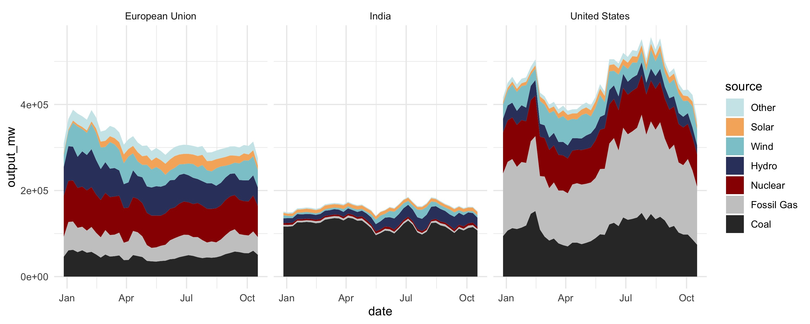
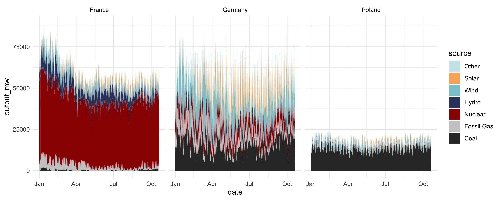
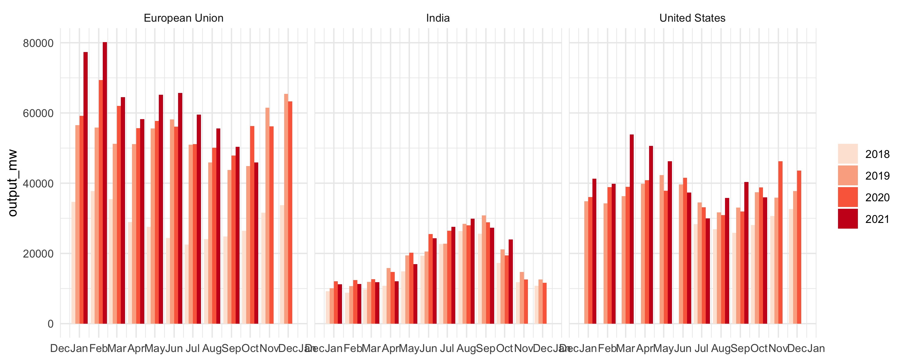

# creapower

<!-- badges: start -->
<!-- badges: end -->

`creapower` is a R package dedicated to **retrieving power generation data** from various sources, namely:
- EIA
- ENTSO-E
- POSOCO (through [Robbie Andrew's](https://robbieandrew.github.io/india/) repository)


Data is regularly updated and cached on CREA Google Bucket. Hence, this package does not require user to own api keys or security tokens for any of the various sources.

## Installation

You can install the released version of creapower from [CRAN](https://CRAN.R-project.org) with:

``` r
library(remotes)
remotes::install_github("energyandcleanair/creapower")
```

## Example


``` r
library(tidyverse)
library(creapower)

# Get Germany generation data with homogenised sources (Coal, Hydro, Wind, Solar etc.)
creapower::get_generation(date_from="2021-01-01", iso2="DE")
creapower::get_generation(date_from="2021-01-01", iso2="DE", freq="day")
creapower::get_generation(date_from="2021-01-01", iso2="DE", freq="month")

# Get all available countries generation data with homogenised sources
# (i.e. Coal, Fossil Gas, Nuclear, Hydro, Wind, Solar, Other)
creapower::get_generation(date_from="2021-01-01")

# Get generation data with original sources
# (e.g. Lignite coal, Hydro pump storage, Wind offshore, Wind onshore etc.)
creapower::get_generation(date_from="2021-01-01", iso2=c("DE","FR","PL"), homogenise=F)

# Get generation data from specific data source(s)
creapower::get_generation(date_from="2021-01-01", iso2="DE", data_source="entso")
creapower::get_generation(date_from="2021-01-01", data_source=c("entso","eia"))

# Available data sources
creapower::available_data_sources()

# Get generation data from specific data source(s)
gen_weekly <- creapower::get_generation(date_from="2021-01-01",
                                        iso2=c("EU","US","IN"),
                                        freq="week")

ggplot(gen_weekly) +
  geom_area(aes(date, output_mw, fill=source),
            position = position_stack(reverse = TRUE)) +
  theme_minimal() +
  scale_fill_power() +
  facet_wrap(~region)
```



```r
# Generation is returned at the hourly level by default (when available)
gen_hourly <- creapower::get_generation(date_from="2021-01-01", iso2=c("DE","FR","PL"))

ggplot(gen_hourly) +
  geom_area(aes(date, output_mw, fill=source),
            position = position_stack(reverse = TRUE)) +
  theme_minimal() +
  scale_fill_power() + 
  facet_wrap(~region)
```


```r
# Renewable generation
gen_ren <- creapower::get_generation(date_from="2018-01-01", iso2=c("US","EU","IN"), freq="month") %>%
  filter(grepl('Hydro|Wind|Solar', source)) %>%
  mutate(year=lubridate::year(date),
         date0000=lubridate::`year<-`(date,2000)) %>%
  tidyr::complete(year, date0000, tidyr::nesting(iso2, region, source, data_source),
                  fill=list(output_mw=0))


ggplot(gen_ren) +
  geom_bar(aes(date0000, output_mw, fill=factor(year)),
           stat="identity",
           position="dodge") +
  scale_fill_brewer(palette="Reds", name=NULL) +
  scale_x_datetime(
    labels = scales::date_format("%b"),
    date_breaks="1 month",
    name=NULL
  ) +
  theme_minimal() +
  facet_wrap(~region)
```


